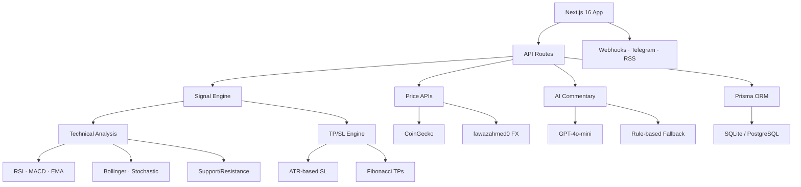

<div align="center">

# ⚡ Alpha Scanner

**AI-powered multi-asset trading signal scanner**

Real-time technical analysis signals for metals, crypto, and forex — with AI commentary, backtesting, and one-click deployment.

[](https://github.com/naimkatiman/alpha-scanner/actions/workflows/ci.yml)
[](LICENSE)
[](https://github.com/naimkatiman/alpha-scanner/stargazers)
[](https://github.com/naimkatiman/alpha-scanner/network/members)

[Live Demo](https://alpha-scanner.vercel.app) · [Deploy Guide](docs/DEPLOY.md) · [Contributing](CONTRIBUTING.md) · [Report Bug](.github/ISSUE_TEMPLATE/bug_report.md) · [Request Feature](.github/ISSUE_TEMPLATE/feature_request.md)

</div>

---

## ✨ Features

| | Feature | Description |
|---|---|---|
| 📡 | **Real-Time Signals** | BUY/SELL/NEUTRAL signals with confidence scoring, updated every 30s |
| 🌍 | **12 Assets** | Metals (XAU, XAG), Crypto (BTC, ETH, XRP, SOL, DOGE, ADA), Forex (EUR/USD, GBP/USD, USD/JPY, AUD/USD) |
| 🤖 | **AI Commentary** | GPT-4o-mini explains *why* each signal fired in plain English |
| 📊 | **6-Factor Analysis** | RSI, MACD, EMA alignment, S/R proximity, Bollinger Bands, Stochastic |
| 🕐 | **Multi-Timeframe** | M15 / H1 / H4 / D1 confluence scoring |
| 🧪 | **Backtesting** | Replay signals against historical data with equity curves |
| 💰 | **Paper Trading** | $10K virtual account with auto-trade mode |
| 📱 | **Telegram Alerts** | Get signal notifications via Telegram bot |
| 🔗 | **Webhook Integration** | POST signals to any URL — connect your trading bot |
| 🎯 | **Strategy Templates** | Save, share, and import signal configurations |
| 📈 | **Accuracy Tracking** | Server-side TP/SL hit tracking with public stats |
| 🏆 | **Leaderboard** | Rank symbols by win rate (weekly / monthly / all-time) |
| 📰 | **RSS Feed** | Subscribe to signals at `/feed.xml` |
| 📲 | **PWA** | Install as a mobile app with offline support |
| ⚙️ | **Custom Alerts** | Build rules with RSI/MACD/BB thresholds and AND/OR logic |
| 🔐 | **User Accounts** | Email auth, saved settings, guest mode fallback |
| 🏗️ | **Broker Connect** | MetaApi integration for live MT4/MT5 accounts |

---

## 🖼️ Screenshots

<div align="center">

| Dashboard | Signal Panel | Backtest |
|---|---|---|
|  |  |  |

</div>

> Add your own screenshots to `docs/screenshots/`

---

## 🏗️ Architecture



---

## 🛠️ Tech Stack

| Layer | Technology |
|---|---|
| Framework | Next.js 16 (App Router) |
| Styling | Tailwind CSS v4 + Ethereal Glass design |
| Database | Prisma 5 + SQLite (dev) / PostgreSQL (prod) |
| Auth | NextAuth.js v4 (credentials provider) |
| Animation | framer-motion |
| Charts | HTML5 Canvas (candlesticks, equity curves) |
| AI | OpenAI GPT-4o-mini |
| Language | TypeScript (strict mode) |

---

## 🚀 Quick Start

### Prerequisites

- Node.js 22+
- npm 10+

### Manual Setup

```bash
# Clone the repo
git clone https://github.com/naimkatiman/alpha-scanner.git
cd alpha-scanner

# Install dependencies
npm install

# Configure environment
cp .env.example .env
# Edit .env with your settings (see Environment Variables below)

# Set up database
npx prisma generate
npx prisma db push

# Start development server
npm run dev
```

Open [http://localhost:3000](http://localhost:3000)

### Docker Setup

```bash
# Clone and start
git clone https://github.com/naimkatiman/alpha-scanner.git
cd alpha-scanner

# Build and run
docker compose up -d

# App available at http://localhost:3000
```

---

## ⚙️ Environment Variables

| Variable | Required | Description |
|---|---|---|
| `DATABASE_URL` | Yes | Database connection string (`file:./dev.db` for SQLite) |
| `NEXTAUTH_SECRET` | Yes | Random secret for NextAuth sessions |
| `NEXTAUTH_URL` | Yes | App URL (e.g. `http://localhost:3000`) |
| `OPENAI_API_KEY` | No | GPT-4o-mini for AI commentary (falls back to rule-based) |
| `TELEGRAM_BOT_TOKEN` | No | Telegram bot token for signal alerts |
| `TELEGRAM_CHAT_ID` | No | Telegram chat ID for CI notifications |

See [`.env.example`](.env.example) for a full template.

---

## 📦 Deployment

One-click deploy to your preferred platform:

[](https://vercel.com/new/clone?repository-url=https://github.com/naimkatiman/alpha-scanner&env=DATABASE_URL,NEXTAUTH_SECRET,NEXTAUTH_URL)
[](https://railway.app/template?referralCode=alpha-scanner)

See the full [Deployment Guide](docs/DEPLOY.md) for detailed instructions.

---

## 🤝 Contributing

Contributions are welcome! Please read our [Contributing Guide](CONTRIBUTING.md) and [Code of Conduct](CODE_OF_CONDUCT.md) before submitting a PR.

```bash
# Fork → Clone → Branch → Code → PR
git checkout -b feat/your-feature
npm run build  # Must pass!
git commit -m "feat: add your feature"
git push origin feat/your-feature
```

---

## 📄 License

[MIT](LICENSE) — use it, fork it, ship it.

---

<div align="center">

**If Alpha Scanner helps your trading, give it a ⭐**

[](https://star-history.com/#naimkatiman/alpha-scanner&Date)

Made with ⚡ by the Alpha Scanner community

</div>
